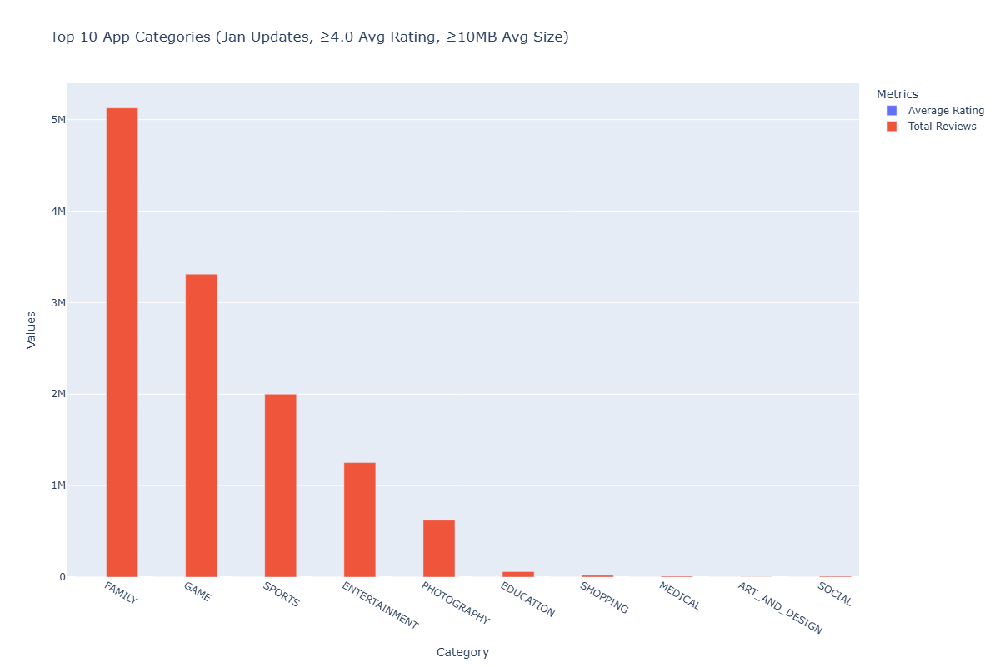
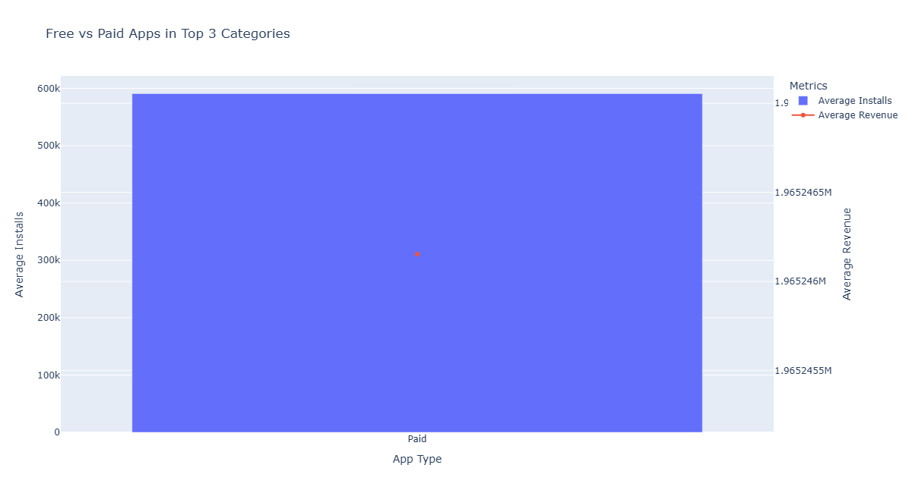
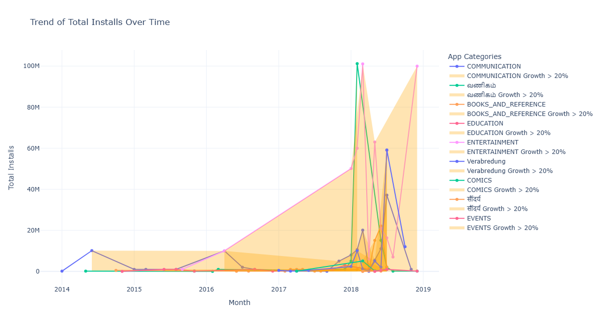
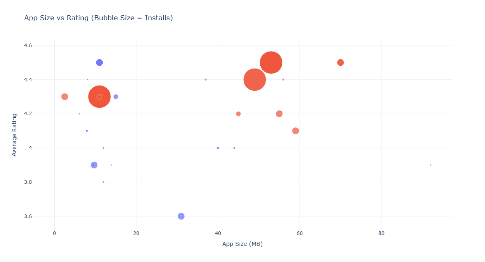
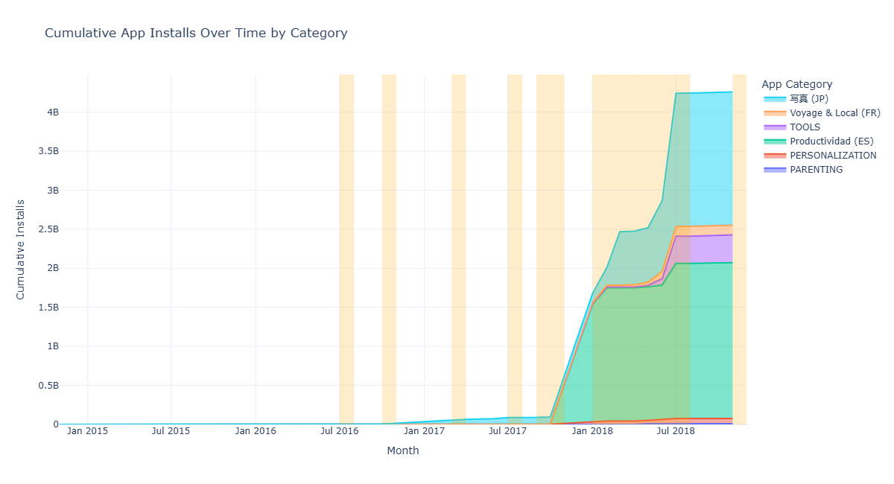

# 📊 Google Playstore App Analytics Dashboard Project

This project is a **Python-based data analytics and visualization dashboard**.
It focuses on **analyzing Google Play Store app data** through six data-driven tasks using **Pandas**, **Matplotlib**, and **Plotly** for interactive visualizations.

---

## 🧠 Project Overview

- Cleaned, filtered, and analyzed **7,000+ app records**.
- Designed **6 interactive tasks**, each showcasing different analytical skills.
- Added **time-based display logic**, **language translation**, and **custom conditions**.
- Automated chart generation for data storytelling.
- Focused on practical data visualization and dashboard development skills.

---

## 🗂️ Folder Structure

GooglePlayStore-Analytics-Dashboard/
│

├── data/ # Raw and processed Excel / CSV files

├── images/ # Supporting images

├── plots/ # Auto-generated charts from each task

│

├── task1.py # Task 1: Category Analysis

├── task2.py # Task 2: Rating Distribution

├── task3.py # Task 3: Sentiment Visualization

├── task4.py # Task 4: Multilingual Category Replacement

├── task5.py # Task 5: Bubble Chart Analysis

├── task6.py # Task 6: Stacked Area Chart of Installs

│

├── data_cleaning.ipynb # Data preprocessing and cleaning

├── build_dashboard.py # Main file to assemble the dashboard

│

├── README.md # Project overview 

└── requirements.txt # Python dependencies

---

## ⚙️ Technologies Used

| Category | Tools / Libraries |
|-----------|------------------|
| **Language** | Python 3.10+ |
| **Data Handling** | Pandas, NumPy |
| **Visualization** | Matplotlib, Plotly |
| **Text Processing** | TextBlob |
| **Automation** | Datetime-based task filters |
| **Environment** | Jupyter Notebook, VS Code |

---

## 🚀 How to Run

1. **Clone the Repository**
   ```bash
   git clone https://github.com/yourusername/GooglePlayStore-Analytics-Dashboard.git
   cd App-Analytics-Dashboard

2. **Install Required Libraries**
```bash
pip install -r requirements.txt
```
3. **Run the Dashboard**
```bash
python build_dashboard.py
```
The dashboard will only display certain visualizations during specific IST time windows (as per each task).

## 🧩 **Task Explanations**

### 🟩 **Task 1 – Category Distribution**
Visualizes how many apps exist in each category using a bar chart.  
Helps understand which categories dominate the app store.

---

### 🟦 **Task 2 – Rating Distribution**
Shows average ratings per app category using a horizontal bar graph.  
Highlights categories with the best user satisfaction.

---

### 🟨 **Task 3 – Sentiment Analysis**
Performs sentiment analysis on user reviews and plots the results to show polarity trends.

---

### 🟧 **Task 4 – Multilingual Category Replacement**
Replaces certain categories with translations for multilingual support.

| Category (English) | Translation | Language |
|--------------------|-------------|-----------|
| Beauty             | **सौंदर्य** | Hindi 🇮🇳 |
| Business           | **வணிகம்**  | Tamil 🇮🇳 |
| Dating             | **Verabredung** | German 🇩🇪 |
| Photography        | **写真 (Shashin)** | Japanese 🇯🇵 |

✅ Ensures multilingual support for global data visualization.

---

### 🟪 **Task 5 – Bubble Chart (Filtered Analysis)**
Plots a bubble chart showing:
- **X-axis →** App Size (MB)  
- **Y-axis →** Average Rating  

---

## 📈 **Sample Plot Previews**

> 📂 *All plots are located inside the `/plots` directory.*

| Visualization | Preview |
|---------------|----------|
| **Bar Chart (Category Distribution)** |  |
| **Sentiment Analysis** |  |
| **Category Translation Map** |  |
| **Bubble Chart (Filtered Analysis)** |  |
| **Stacked Area Chart** |  |


**👨‍💻 Author**
*Jovin Ryan Samuel*
